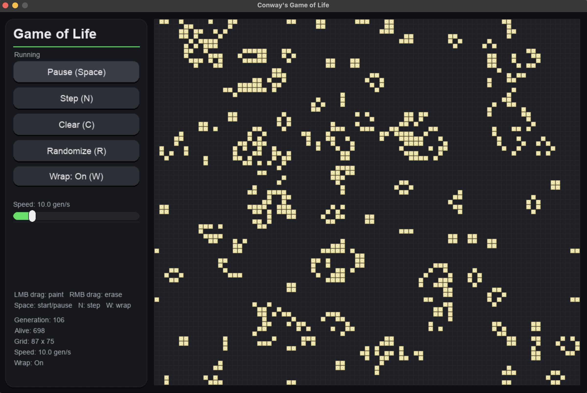

# conways-game-of-life

Interactive Conway’s Game of Life simulator built with Python and Pygame, featuring adjustable speed, wrapping modes, and a polished UI.

---

## Features

- Start / Pause simulation
- Step one generation at a time
- Clear the grid
- Randomize the grid with configurable density (in code)
- Speed control (generations per second)
- Wrap toggle (toroidal wrapping on/off)
- Live stats:
  - Generation
  - Alive cell count
  - Grid size
  - Simulation speed
  - Wrap mode
- Mouse drawing:
  - Left-click / drag: paint cells alive
  - Right-click / drag: erase cells

---

## Controls

Keyboard:
- Space — Start / Pause
- N — Step one generation
- C — Clear grid
- R — Randomize grid
- W — Toggle wrapping mode

Mouse:
- Left-click / drag — Paint cells
- Right-click / drag — Erase cells

---

## Getting Started

Requirements:
- Python 3.9+
- Pygame

Install:
pip install pygame

Run:
python main.py

---

## Project Structure

conways-game-of-life/
│
├── main.py          # Application entry point & UI loop
├── creatures.py     # Game of Life cell logic & simulation rules
├── gameboard.py     # UI components (buttons, slider, panel, grid)
├── vars.py          # Layout configuration, colors, fonts
├── Assets/
│   └── screenshot.png
└── README.md

---

## Implementation Notes

- Implements standard Conway’s Game of Life rules.
- Optional toroidal wrapping mode.
- Simulation step is computed in two passes:
  1. Compute next state
  2. Apply next state
- Frame-rate independent simulation timing using accumulated delta time.
- UI components implemented manually (no external UI framework).
- Layout dynamically scales based on screen resolution.

---

## About Conway’s Game of Life

Conway’s Game of Life is a zero-player cellular automaton devised by mathematician John Conway in 1970. It demonstrates how complex patterns can emerge from simple rules.

---

## Author

Nate Parish
GitHub: https://github.com/NateParish

---

## License

This project is licensed under the MIT License. See the LICENSE file for details.
